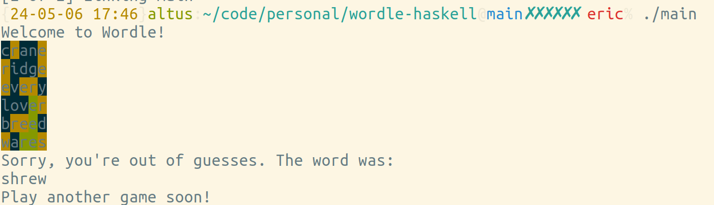

wordle-haskell
==============

Wordle clone in Haskell. Terminal-based!

#### TO-DO

* Makefile that builds, lints, installs dependencies, etc.
* Switch from partial functions like `!!` to safe versions
* Tests
* Track player's stats (win rate, etc.)
